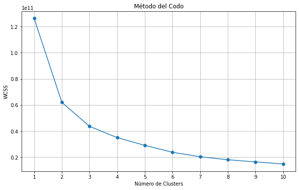
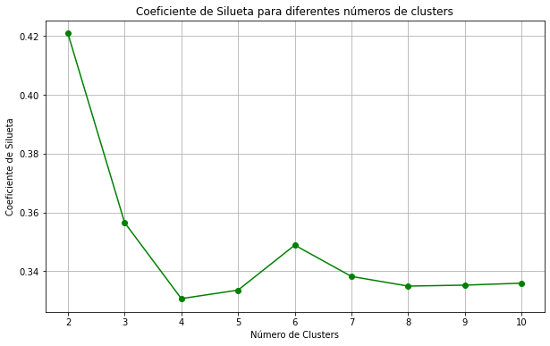
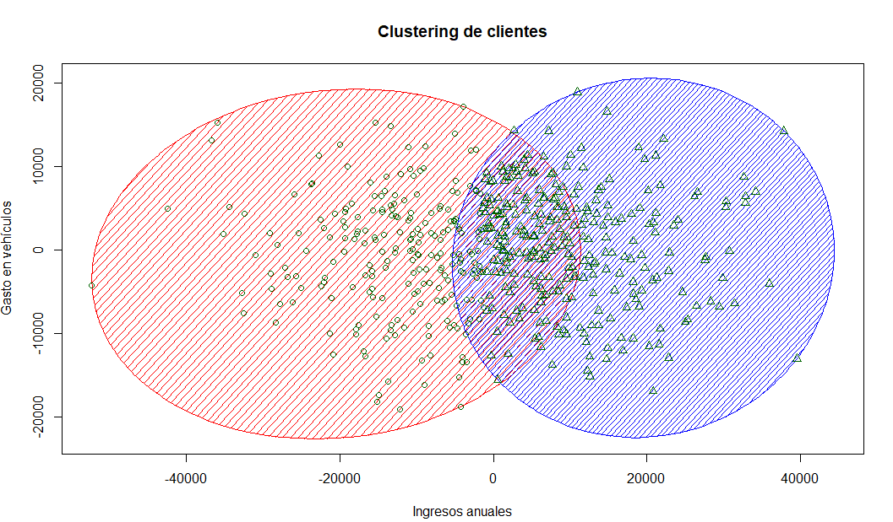

# Segmentación de Clientes para Concesionario de Coches K-Means Clustering Machine learning


## Tabla de Contenidos
- [Descripción](#descripción)
- [Tecnologías Utilizadas](#tecnologías-utilizadas)
- [Características del Proyecto](#características-del-proyecto)
- [Instalación](#instalación)
- [Uso](#uso)
- [Visualizaciones](#visualizaciones)
- [conclusiones](#conclusiones)
- [Licencia](#licencia)
- [Licencia](#licencia)

## Descripción

Este proyecto tiene como objetivo segmentar a los compradores de coches de una ciudad utilizando el algoritmo de **K-Means** basado en dos características clave: **Ingresos Anuales** y **Gastos en Vehículos**. 
La segmentación de clientes es fundamental para diseñar estrategias de marketing más efectivas, permitiendo al concesionario enviar publicidad dirigida y personalizada a sus potenciales clientes, optimizando así los recursos y aumentando las tasas de conversión.

## Tecnologías Utilizadas

- **Lenguajes de Programación:**
  - Python 3.12
  - R 3.6.3
- **Entornos de Desarrollo:**
  - Spyder 5
  - RStudio
- **Librerías y Paquetes:**
  - Python:
    - NumPy
    - Pandas
    - Matplotlib
    - Seaborn
    - Scikit-learn
    - Chardet
  - R:
    - readr
    - ggplot2
    - cluster
    - factoextra
    - dplyr

## Características del Proyecto

- **Carga y Limpieza de Datos:**
  - Detección automática de la codificación del archivo CSV.
  - Manejo de valores faltantes mediante eliminación de filas incompletas.
- **Selección de Características:**
  - Análisis basado en **Ingresos Anuales** y **Gastos en Vehículos**.
- **Determinación del Número Óptimo de Clusters:**
  - Método del Codo (Elbow Method).
  - Coeficiente de Silueta (Silhouette Score).
- **Aplicación del Algoritmo K-Means:**
  - Segmentación de clientes en clusters óptimos.
- **Visualización de Clusters:**
  - Gráficos de dispersión con centroides destacados.
  - Boxplots para analizar la distribución de características por cluster.
- **Análisis Descriptivo de Clusters:**
  - Estadísticas descriptivas para cada segmento de clientes.

## Instalación
```bash
git clone https://github.com/moises60/Regresion-logistica-machine-learning.git
```
## Visualizaciones
# Método del Codo


# Coeficiente de Silueta


# Clusters de Clientes Python


# Clusters de Clientes R

# conclusiones 
Clientes Estandar: Representan una base sólida de clientes con ingresos y gastos equilibrados, ideales para ofertas estándar.
Clientes Objetivo: Son los clientes de alto valor con mayores ingresos y gastos, perfectos para promociones de vehículos de gama alta o servicios premium.

# Licencia
El dataset está licenciado bajo la [Licencia Apache 2.0](LICENSE).
(https://www.kaggle.com/code/faraahanwaaar/car-sales-price-prediction/notebook)